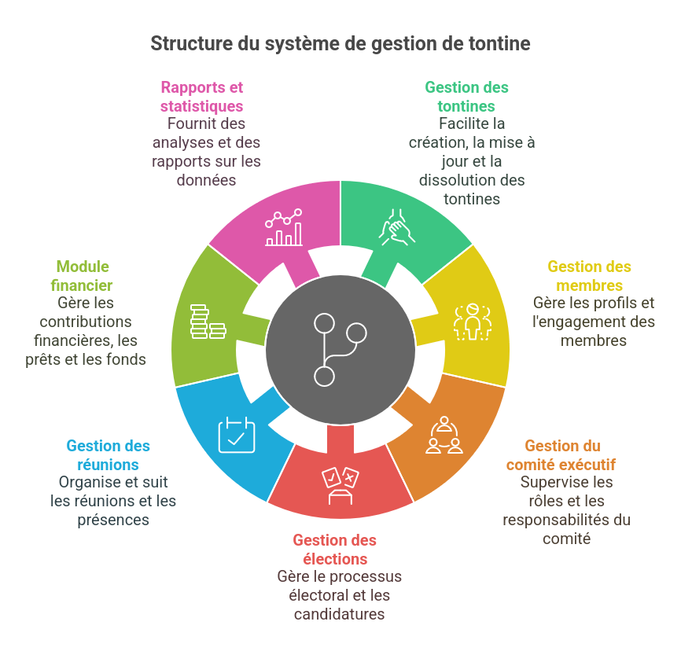

# Application Access permettant la création et l'administration de tontines
Ce projet est une application avec interface graphique sur Access permettant la gestion des tontines. Les tontines sont des associations collectives qui réunissent des épargnants afin d’investir en commun pour lever des capitaux. Ainsi, notre application va permettre de faciliter l'administration et le suivi des opérations effectuées et également l'état financier des  membres des tontines.

## Fonctionnalités



- Créer des tontines, réunions, membres.
- Gérer les élections dans une tontine.
- Gérer les transactions financières (contributions, prêts, fonds et mouvements d'actifs).
- Établir les rapports et statistiques des tontines.

---
## Installation et Compilation
Vous devez disposer de **Microsoft Access  2003** minimum.

1. Cloner le dépôt
Clonez le projet depuis GitHub :
```sh
git clone https://github.com/johanalain11/gestion-tontines.git
cd gestion-tontines
```
2. Ouvrir l'éxécutable Access
```sh
./executable.accbde
```

---
## Utilisation
1. Lancez le programme.

2. Connectez vous avec un identifiant valide (disponible dans README.txt).

3. Choisir la catégorie à consulter dans le dashboard (tontine, réunion, membre, ...).

4. Choisir l'opération à effectuer sur une tontine par exemple :
    * Ajouter une tontine.
    * Modifier une tontine.
    * Rechercher une tontine.
    * Afficher le nœud maximum.
    * Supprimer une tontine.
    * Consulter la liste des tontines.
    * Imprimer la liste des tontines.

---
## Exemple d'exécution


---
## Structure de données
La gestion des tontines implémente le MLD suivant:


---
## Technologies Utilisées
**Logiciel :** Microsoft Access 2003 ou ultérieur

**Langage de requête :** SQL 

---
## Améliorations Futures
>[!NOTE]
>
>* Ajouter une interface de communication entres les utilisateurs.
>* Ajouter un système de manipulation des tontines en ligne.
>* Gérer les erreurs potentielles, comme des entrées invalides ou des dépassements de mémoire.
>* Ajouter un système de sauvegarde et de chargement des données dans un fichier.

## Auteur
**Johan Alain**

[GitHub](https://github.com/johanalain11/)

